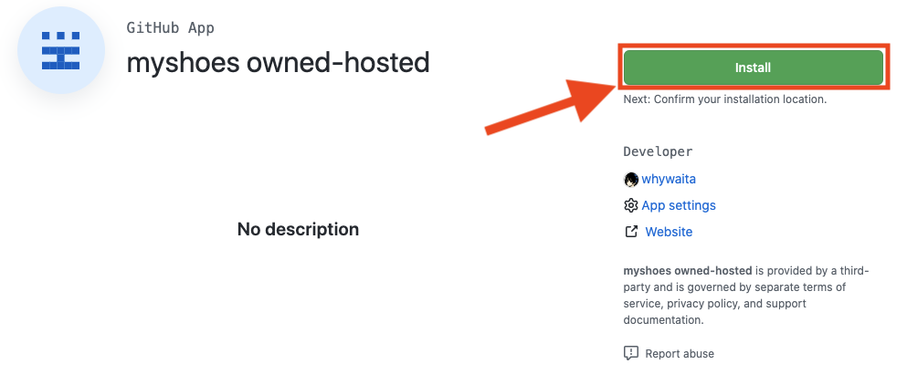

# Setup (only once)

## Goal

- Start provision runner

## Prepare

- Get GitHub Apps's Public page from myshoes admin.
  - e.g.) `https://github.com/apps/<GitHub Apps name>` or `<GHES url>/github-apps/<GitHub Apps name>`
- Get Endpoint for myshoes from myshoes admin.
  - e.g.) `<your_shoes_host>/target`

## Repository or Organization setup

### Install GitHub Apps

Please open GitHub Apps's Public page and install GitHub Apps to Organization or repository.




### Register target to myshoes

you need to register a target that repository or organization.

- `scope`: set target scope for an auto-scaling runner.
  - Repository example: `octocat/hello-worlds`
  - Organization example: `octocat`
- `resource_type`: set instance size for a runner.
  - We will describe later.
  - Please teach it from myshoes admin.

Example (create a target):

```bash
$ curl -XPOST -d '{"scope": "octocat/hello-world", "resource_type": "micro"}' ${your_shoes_host}/target
```

You can check registered targets.

```bash
curl -XGET ${your_shoes_host}/target | jq .
[
  {
    "id": "477f6073-90d1-47d8-958f-4707cea61e8d",
    "scope": "octocat",
    "token_expired_at": "2006-01-02T15:04:05Z",
    "resource_type": "micro",
    "provider_url": "",
    "status": "active",
    "status_description": "",
    "created_at": "2006-01-02T15:04:05Z",
    "updated_at": "2006-01-02T15:04:05Z"
  }
]
```

#### Switch `resource_type`

You can set `resource_type` in target. So myshoes switch size of instance.

For example,

- In organization scope (`octocat`), want to set small size runner as a `nano`.
- But specific repository (`octocat/huge-repository`), want to set big size runner as a `4xlarge`.

So please configure it.

```bash
$ curl -XPOST -d '{"scope": "octocat", "resource_type": "nano"}' ${your_shoes_host}/target
$ curl -XPOST -d '{"scope": "octocat/huge-repository", "resource_type": "4xlarge"}' ${your_shoes_host}/target

$ curl -XGET ${your_shoes_host}/target | jq .
[
  {
    "id": "477f6073-90d1-47d8-958f-4707cea61e8d",
    "scope": "octocat",
    "token_expired_at": "2006-01-02T15:04:05Z",
    "resource_type": "nano",
    "provider_url": "",
    "status": "active",
    "status_description": "",
    "created_at": "2006-01-02T15:04:05Z",
    "updated_at": "2006-01-02T15:04:05Z"
  },
  {
    "id": "3775e3b6-08e0-4abc-830d-fd5325397de0",
    "scope": "octocat/huge-repository",
    "token_expired_at": "2006-01-02T15:04:05Z",
    "resource_type": "4xlarge",
    "provider_url": "",
    "status": "active",
    "status_description": "",
    "created_at": "2006-01-02T15:04:05Z",
    "updated_at": "2006-01-02T15:04:05Z"
  }
]
```

In this configuration, myshoes will create under it.

- In `octocat/normal-repository`, will create `nano`
- In `octocat/normal-repository2`, will create `nano`
- In `octocat/huge-repository`, will create `4xlarge`

### Create an offline runner (only use `check_run` mode)

GitHub Actions need offline runner if queueing job.
Please create an offline runner in the target repository.

https://docs.github.com/en/free-pro-team@latest/actions/hosting-your-own-runners/adding-self-hosted-runners

Please delete a runner after registered.

After that, You can use [cycloud-io/refresh-runner-action](https://github.com/cycloud-io/refresh-runner-action) for automation.

### Let's go using your shoes!

Let's execute your jobs! :runner::runner::runner:
